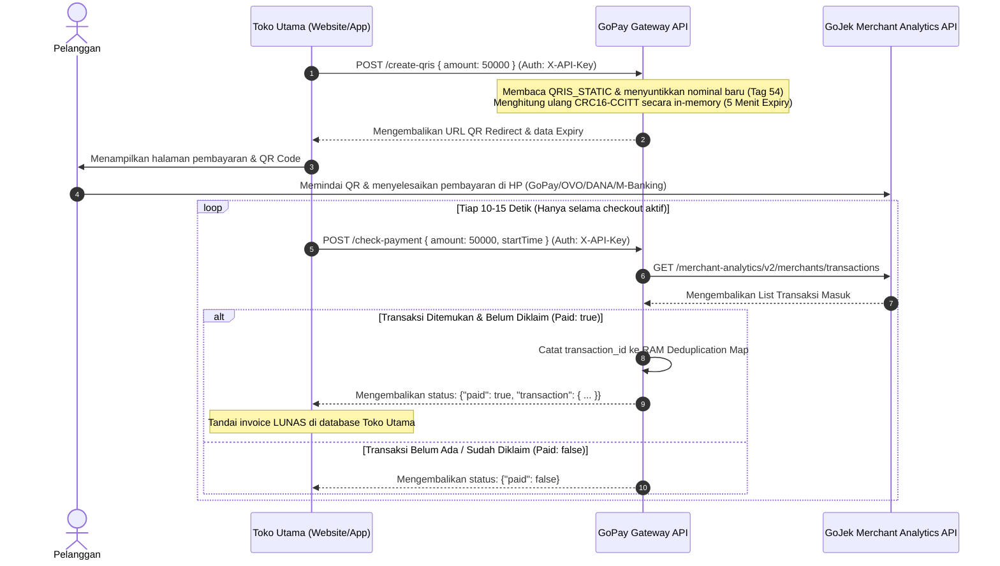

# 🚀 GoPay Partner / Merchant API Gateway (Stateless Edition)

[](https://nodejs.org)
[](https://expressjs.com)
[](https://www.docker.com/)
[](#)

API Gateway berkinerja tinggi, ringan, dan fleksibel (mendukung **Stateful via VPS** maupun **Stateless via Cloud**) tanpa database permanen, untuk otomatisasi verifikasi mutasi transaksi GoPay Merchant, pencetakan QRIS Dinamis berstandar EMVCo (CRC16-CCITT) 5 Menit, serta pemantauan status transaksi realtime.

---

> [!IMPORTANT]
> ### ⚠️ Disclaimer: Unofficial API Gateway
> Proyek ini adalah **Unofficial API Gateway** yang **TIDAK berafiliasi, TIDAK didukung, dan TIDAK disetujui secara resmi oleh PT. GoTo Gojek Tokopedia Tbk atau GoPay** dalam kapasitas apapun.
> 
> Gateway ini bekerja dengan cara membaca data transaksi dari **GoFood Merchant Portal / GoJek Analytics API** menggunakan sesi akun merchant Anda sendiri (Cookie / JWT Token).
> 
> **Kenapa Aman Digunakan?**
> *   ✅ **Tidak ada credential yang keluar**: Token, Cookie, & API Key disimpan di server Anda sendiri di file `.env` dan **tidak pernah dikirim ke pihak ketiga manapun**.
> *   ✅ **Read-Only & Non-Destruktif**: Gateway ini **hanya membaca** data mutasi transaksi dan tidak pernah melakukan transaksi keluar, penarikan dana, atau perubahan saldo.
> *   ✅ **Zero Third-Party**: Semua lalu lintas data berjalan langsung dari server Anda ke endpoint resmi `api.gojekapi.com`.

---

## 🧭 Diagram Alur Pengecekan Stateless (Client-Polled)

Arsitektur ini didesain sangat aman dari deteksi pemblokiran (*rate-limit*) GoJek, karena gateway **hanya memanggil API GoJek secara pasif saat dipicu oleh halaman checkout aktif di toko Anda**. Saat toko sepi atau malam hari, jumlah panggilan API adalah **NOL (0)**.



---

## 🎯 Cara Kerja & Konsep Utama Sistem

> [!WARNING]
> ### 🚨 WAJIB MENGGUNAKAN VPS (Tidak Mendukung Serverless Cloud Gratis)
> Sistem *Autonomous Auto-Login* gateway ini **WAJIB di-deploy di VPS (Virtual Private Server) atau Dedicated Server** yang memiliki penyimpanan permanen (*Persistent Storage*) seperti Hostinger, DigitalOcean, AWS EC2, Contabo, dsb.
> 
> **JANGAN menggunakan layanan cloud gratisan/ephemeral seperti Render.com, Vercel, Heroku, atau Railway!**
> Layanan tersebut sering melakukan "Sleep" dan *restart* yang **menghapus semua file lokal** (termasuk `.gopay_cache.json`). Jika ini terjadi, gateway Anda akan melakukan *spam Auto-Login* ke server Gojek setiap kali server terbangun, yang sangat berisiko membuat akun GoBiz Anda terkena limitasi atau pemblokiran dari Gojek.

### 1. Autonomous Caching & Zero-Database
Sistem ini tidak memerlukan database besar (PostgreSQL/MySQL). Penyimpanan sesi disesuaikan secara mandiri oleh sistem:
- Setiap kali *login* sukses, gateway akan otomatis membuat dan menyimpan token sesi ke dalam file `.gopay_cache.json` di direktori VPS Anda. 
- Saat aplikasi Node.js atau PM2 di-restart, gateway tinggal membaca ulang file JSON tersebut tanpa perlu melakukan *login* ulang.

### 2. In-Memory Dynamic QRIS EMVCo Generator (5 Menit Expiry)
Proses pembuatan QRIS Dinamis **0% menembak API GoJek**. Server `server.js` membaca QRIS Statis stiker Anda (`QRIS_STATIC`), menyuntikkan Tag Nominal `54`, dan menghitung ulang kode checksum 4-karakter **CRC16-CCITT** secara in-memory dalam hitungan milidetik.
- **Masa Aktif**: Diberi batas waktu 5 menit (`expires_in: "5 menit"`).
- **Public Image Redirect**: Menghasilkan link publik `GET /qr/:id` yang langsung mengarahkan ke gambar QR Code siap tampil di web toko.

### 3. In-Memory Transaction Deduplication (Anti Double-Claim)
Jika dua pelanggan berbeda melakukan checkout dengan nominal yang sama (misal Rp 50.000) pada waktu bersamaan, sistem secara otomatis mencatat `transaction_id` yang sukses divalidasi ke dalam *Map* memori RAM. Jika ada klaim transaksi ulang menggunakan ID yang sama dalam 24 jam, gateway akan menolaknya (`paid: false`).

---

## 🔑 Metode Autentikasi / Login (Autonomous)

Sistem gateway ini **100% mandiri (Autonomous)**. Anda tidak perlu lagi repot-repot memanggil endpoint login khusus.

### Cara Kerja Autonomous Auto-Login:
1. Pastikan Anda telah memasukkan `GOPAY_EMAIL` dan `GOPAY_PASSWORD` (kredensial login GoBiz) di file `.env`.
2. Saat aplikasi Anda (atau Anda sendiri) meminta data mutasi melalui `GET /transactions` atau `POST /check-payment`, gateway akan mengecek status *cookie*.
3. Jika *cookie* belum ada atau telah kedaluwarsa (GoJek membalas dengan error `401 Unauthorized`), gateway akan **secara diam-diam dan otomatis** melakukan login ulang ke GoJek.
4. Gateway akan menyimpan sesi login yang baru ke dalam file `.gopay_cache.json` sehingga aman meskipun server VPS Anda di-*restart*.
5. Setelah berhasil mendapatkan *cookie* baru, gateway langsung melanjutkan dan menyelesaikan proses pengecekan transaksi Anda tanpa mengirimkan pesan error.

## 📡 Dokumentasi API Endpoints Lengkap

Seluruh endpoint memerlukan Header `X-API-Key: <YOUR_API_KEY>` atau Query Param `?api_key=<YOUR_API_KEY>`.

### 📋 Tabel Ringkasan Endpoints API

| Method | Endpoint | Fungsi | Autentikasi |
| :--- | :--- | :--- | :--- |
| **GET** | `/` | Status root server | Public |
| **GET** | `/health` / `/api/health` | Health Check server | Public |
| **POST** | `/check-payment` | Verifikasi lunas nominal transaksi | API Key |
| **POST** | `/create-qris` | Generate QRIS Dinamis (5 Menit Expiry) + Redirect | API Key |
| **GET** | `/qr/:id` | Tampilan Gambar QR Code di Browser | Public |
| **GET** | `/transactions` | Ambil daftar mutasi transaksi terakhir | API Key |
| **GET** | `/transactions/all` | Ambil seluruh mutasi transaksi bulan ini | API Key |
| **GET** | `/token-status` | Cek status kesehatan Cookie/Token GoPay | API Key |
| **GET** | `/api/logs` | Monitoring 100 log aktivitas memori | API Key |

---

### 1. Verifikasi Pembayaran (`POST /check-payment`)
- **Headers**: `X-API-Key: supersecretkey123`, `Content-Type: application/json`
- **Body**:
  ```json
  {
    "amount": 1100,
    "startTime": "2026-07-21T00:00:00.000Z"
  }
  ```
- **Respon Sukses (Paid: true)**:
  ```json
  {
    "success": true,
    "paid": true,
    "transaction": {
      "transaction_id": "019f84f1-9a30-7000-8cd6-7e8fb377398e",
      "order_id": "QRIS-0120260721135054iD7q2sbZcJID",
      "amount": 1100,
      "payer_issuer": "SEABANK",
      "payment_type": "QRIS",
      "transaction_time": "2026-07-21T20:50:54+07:00"
    }
  }
  ```

---

### 2. Generate Dynamic QRIS (`POST /create-qris`)
- **Body**:
  ```json
  {
    "amount": 50000
  }
  ```
- **Respon**:
  ```json
  {
    "success": true,
    "data": {
      "qris_url": "http://localhost:3000/qr/a1b2c3d4",
      "qris_code": "0002010102112658...540550000...6304XXXX",
      "amount": 50000,
      "expires_at": "2026-07-21T22:00:00.000Z",
      "expires_in": "5 menit"
    }
  }
  ```

---

## 🛠️ PANDUAN SELF-HOSTING & DEPLOYMENT LENGKAP

Anda dapat mendisematkan `gopay-gateway` di server Anda sendiri menggunakan beberapa metode berikut:

### METODE A: Self-Host di Server VPS (Ubuntu / Debian dengan PM2)

#### 1. Install Node.js & PM2
```bash
curl -fsSL https://deb.nodesource.com/setup_20.x | sudo -E bash -
sudo apt-get install -y nodejs
sudo npm install -y -g pm2
```

#### 2. Clone & Setup Proyek
```bash
git clone https://github.com/ahmadzakiyox/dana-api-gateaway.git
cd gopay-gateway
npm install
cp .env.example .env
```
*(Sesuaikan isi `.env` Anda dengan `GOPAY_COOKIE`, `GOPAY_MERCHANT_ID`, dan `API_KEY`)*.

#### 3. Jalankan via PM2 (Auto-Restart pada Background)
```bash
pm2 start server.js --name gopay-gateway
pm2 save
pm2 startup
```

---

### METODE B: Self-Host Menggunakan Docker & Docker Compose

Proyek ini telah dilengkapi dengan `Dockerfile` dan `docker-compose.yml`.

#### 1. Jalankan Container Docker:
```bash
docker-compose up -d --build
```

#### 2. Cek Log Container:
```bash
docker-compose logs -f
```

---

### METODE C: Deploy Gratis di Cloud (Render / Railway / Vercel)

#### Deploy di Render.com:
1. Buat **Web Service** baru di dashboard Render.com dan hubungkan repo GitHub ini.
2. Set **Build Command**: `npm install`
3. Set **Start Command**: `node server.js`
4. Buka menu **Environment Variables** dan tambahkan:
   - `PORT`: `3000`
   - `API_KEY`: `supersecretkey123`
   - `GOPAY_MERCHANT_ID`: `G020877062`
   - `GOPAY_COOKIE`: `isi_cookie_browser_anda`
   - `QRIS_STATIC`: `isi_qris_statis_toko_anda`

---

## 💻 Panduan Integrasi ke Website Toko Utama

Berikut adalah contoh alur integrasi checkout pembayaran GoPay / QRIS pada aplikasi website Anda:

```javascript
// Contoh Javascript Frontend Checkout
async function prosesPembayaranCheckout(nominalTagihan) {
  // 1. Panggil Gateway untuk buat QRIS Dinamis (5 Menit)
  const qrisRespon = await fetch('http://localhost:3000/create-qris', {
    method: 'POST',
    headers: {
      'Content-Type': 'application/json',
      'X-API-Key': 'supersecretkey123'
    },
    body: JSON.stringify({ amount: nominalTagihan })
  }).then(r => r.json());

  if (!qrisRespon.success) return alert('Gagal membuat QRIS');

  // 2. Tampilkan Gambar QR Code di Layar Pembeli
  document.getElementById('qrImage').src = qrisRespon.data.qris_url;

  // 3. Polling Pengecekan Status Pembayaran Setiap 10 Detik
  const startTimeISO = new Date().toISOString();
  const timerPolling = setInterval(async () => {
    const statusRespon = await fetch('http://localhost:3000/check-payment', {
      method: 'POST',
      headers: {
        'Content-Type': 'application/json',
        'X-API-Key': 'supersecretkey123'
      },
      body: JSON.stringify({ amount: nominalTagihan, startTime: startTimeISO })
    }).then(r => r.json());

    if (statusRespon.paid) {
      clearInterval(timerPolling);
      alert('✅ Pembayaran Berhasil Diterima!');
      window.location.href = '/checkout/sukses';
    }
  }, 10000);
}
```

---

## ❓ Troubleshooting & Penanganan Kode Error

| Status Error | Penyebab | Solusi |
| :--- | :--- | :--- |
| `401 Unauthorized: Invalid API Key` | API Key yang dikirim tidak sesuai dengan `API_KEY` di `.env`. | Periksa kembali header `X-API-Key` atau query param `?api_key=`. |
| `401 Unauthorized (GoJek API)` | Cookie / Token GoPay telah kedaluwarsa atau di-*force logout*. | Ambil Cookie baru dari F12 browser dan kirim ke `POST /update-token`. |
| `410 Gone (QR expired)` | Link gambar QR Code telah melewati batas waktu 5 menit. | Buat QRIS baru via `POST /create-qris`. |
| `paid: false` | Pembayaran belum masuk atau transaksi sudah pernah diklaim dalam 24 jam. | Lakukan pengecekan ulang setelah pembeli menyelesaikan transfer di HP. |