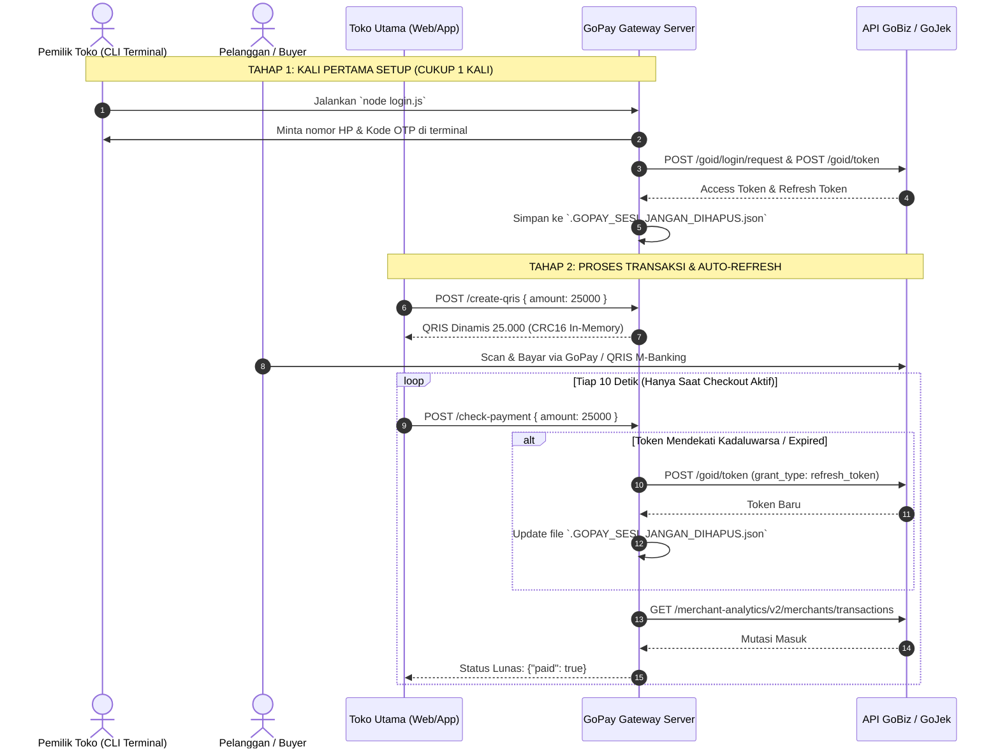

# 🚀 GoPay Merchant Payment Gateway & QRIS API (OTP Edition)

[](https://nodejs.org)
[](https://expressjs.com)
[](https://www.docker.com/)
[](#-sistem-manajemen-sesi--auto-refresh)
[](#)

API Gateway berkinerja tinggi, ringan, dan mandiri (*stateless*) untuk otomatisasi verifikasi mutasi pembayaran **GoPay Merchant / GoFood Merchant**, pencetakan **QRIS Dinamis berstandar EMVCo (CRC16-CCITT)**, serta manajemen sesi otomatis via **CLI OTP Terminal** tanpa memerlukan database SQL yang berat.

---

## ⚡ Fitur Utama & Keunggulan

### 🔐 1. Login Interaktif OTP Terminal (`login.js`)
- **Login Bebas Email/Password**: Login cukup menggunakan Nomor HP (`08...`) melalui terminal CLI interaktif.
- **Auto Format E.164**: Secara otomatis mengubah input nomor HP menjadi format standar GoBiz `country_code: "62"` dan digit angka yang valid.
- **Penyimpanan Sesi Aman**: Menghasilkan file `.GOPAY_SESI_JANGAN_DIHAPUS.json` yang berisi `access_token`, `refresh_token`, `cookie`, `merchant_id`, dan `outlet_name`.

### 🔄 2. Auto-Refresh Token Otomatis (`sessionManager.js`)
- **Zero Manual Re-login**: Cukup login **1 kali di awal**. Token akan terus diperbarui secara otomatis sebelum kadaluwarsa (`expires_at`).
- **In-Place JSON Update**: Memperbarui isi token di dalam file `.GOPAY_SESI_JANGAN_DIHAPUS.json` secara aman tanpa menghapus file fisiknya.
- **Self-Healing 401 Retry**: Jika API GoBiz mengembalikan `401 Unauthorized`, server gateway secara otomatis melakukan *auto-refresh token* di background dan mengulangi request transaksi (*silent retry*).
- **Background Periodic Timer**: Timer otomatis di `server.js` yang memeriksa dan memperbarui token setiap **6 jam sekali**.

### 🎨 3. Dynamic QRIS Generator (In-Memory EMVCo CRC16)
- **0% Call API ke GoJek**: Pembuatan QRIS dinamis dilakukan 100% secara lokal *in-memory* dalam hitungan milidetik.
- **Standards Compliant**: Menyuntikkan Tag Nominal `54` dan menghitung ulang nilai checksum `CRC16-CCITT` sesuai spesifikasi EMVCo QRIS Bank Indonesia.
- **Automatic Image Redirect**: Menyediakan endpoint `GET /qr/:id` yang menghasilkan gambar QR Code siap tampil di web checkout Anda.

### 🛡️ 4. Anti Double-Claim Deduplication
- Memanfaatkan **In-Memory RAM Map** untuk mengunci ID transaksi yang sudah berhasil diverifikasi.
- Mencegah pelanggan mengklaim mutasi transaksi yang sama lebih dari satu kali dalam kurun waktu 24 jam.

---

## 📡 Alur Kerja Sistem (Workflow Diagram)



---

## 🖥️ WAJIB MENGGUNAKAN VPS (Server Permanen)

> [!WARNING]
> ### 🚨 PERSYARATAN SERVER: WAJIB VPS / DEDICATED SERVER!
> Aplikasi gateway ini **WAJIB di-deploy pada VPS (Virtual Private Server)** atau **Dedicated Server** yang memiliki penyimpanan permanen (*Persistent Storage* & *Static Public IP*), seperti:
> - **Hostinger VPS, DigitalOcean Droplet, Vultr, Linode, Biznet Gio, AWS EC2, Contabo, IDCloudHost, dsb.**

### ❌ DILARANG MENGGUNAKAN SERVERLESS / CLOUD GRATISAN!
**Jangan pernah men-deploy gateway ini ke platform Serverless / Ephemeral Free Tier** seperti *Vercel, Render.com (Free Tier), Railway (Free), Netlify, atau Heroku Free*.

#### 🔍 Mengapa Dilarang?
1. **Container Sleep & File Erasure**: Platform serverless gratisan akan mematikan (*sleep*) container saat sepi dan menghapus seluruh file lokal (termasuk file sesi `.GOPAY_SESI_JANGAN_DIHAPUS.json`).
2. **Risiko Spam OTP / Pemblokiran Akun**: Ketika container terbangun kembali karena ada request masuk, sesi login akan hilang dan gateway terpaksa meminta login/refresh berulang kali. Aktivitas ini akan dianggap spam oleh server GoJek dan berisiko tinggi membuat akun GoBiz Anda **terkena limitasi atau pemblokiran permanent**.

---

## ⚠️ Pernyataan Risiko & Kebijakan Unofficial API

> [!IMPORTANT]
> ### 📢 DISCLAIMER & IDENTIFIKASI RISIKO
> Proyek ini adalah **Unofficial API Client/Gateway** yang dikembangkan untuk tujuan integrasi mandiri. Proyek ini **TIDAK berafiliasi, TIDAK didukung, dan TIDAK disetujui secara resmi oleh PT. GoTo Gojek Tokopedia Tbk atau GoPay**.

### ⚠️ Risiko yang Wajib Anda Ketahui:

1. **Perubahan API Tanpa Pemberitahuan (*Unannounced API Changes*)**
   GoJek/GoBiz dapat memperbarui struktur header, endpoint, atau mekanisme autentikasi portal mereka kapan saja tanpa pemberitahuan terlebih dahulu. Jika terjadi pembaruan mayor di server GoBiz, gateway ini mungkin memerlukan penyesuaian kode.

2. **Risiko Rate Limit & Pemblokiran Sesi (*Rate Limiting*)**
   Jika toko Anda melakukan panggilan API (*polling*) secara terlalu agresif (misalnya 100x per detik tanpa jeda), server GoJek dapat mendeteksi aktivitas mencurigakan dan memblokir sementara IP VPS atau membatasi token sesi Anda. 

3. **Tanggung Jawab Pengguna (*User Responsibility*)**
   Penggunaan gateway ini sepenuhnya menjadi tanggung jawab pemilik akun GoBiz. Pastikan Anda mengamankan server VPS Anda dari akses yang tidak sah.

---

## 🔒 Jaminan Keamanan & Privasi

> [!TIP]
> **Mengapa Gateway Ini Sangat Aman Dijalankan di VPS Sendiri?**
> - 🟢 **100% Private & Self-Hosted**: Seluruh kode berjalan di server VPS milik Anda sendiri.
> - 🟢 **Zero Third-Party Telemetry**: Kredensial, Token, Cookie, dan data transaksi **TIDAK PERNAH** dikirim ke server luar manapun selain endpoint resmi `api.gobiz.co.id` & `api.gojekapi.com`.
> - 🟢 **Read-Only Operation**: Gateway ini hanya membaca data transaksi mutasi masuk. Tidak ada endpoint untuk melakukan penarikan uang (*payout*) atau pemindahan saldo.

---

## 🚀 Panduan Instalasi & Penggunaan

### 1. Clone & Install Dependencies
```bash
git clone https://github.com/username/gopay-gateway.git
cd gopay-gateway
npm install
```

### 2. Konfigurasi `.env`
Salin file `.env.example` menjadi `.env`:
```bash
cp .env.example .env
```
Isi konfigurasi pada file `.env`:
```env
PORT=3000
API_KEY=rahasia_api_key_anda_123
GOPAY_MERCHANT_ID=G750935309
QRIS_STATIC=00020101021126590013ID.CO.GOPAY.WWW01189360091400000000000215G0208770625204581253033605802ID5919Toko Alfin Pamekasan6009Pamekasan61056931162070703A016304
```

### 3. Login OTP Terminal (Cukup 1 Kali)
Jalankan script login di terminal:
```bash
node login.js
```
- Masukkan Nomor HP GoBiz (contoh: `085119772671`).
- Masukkan kode OTP 4-digit yang dikirim via SMS/WhatsApp.
- File `.GOPAY_SESI_JANGAN_DIHAPUS.json` akan otomatis dibuat.

### 4. Jalankan Server Gateway (Via PM2 di VPS)
Disarankan menggunakan **PM2** agar server gateway berjalan 24/7 di background VPS:
```bash
npm install -g pm2
pm2 start server.js --name "gopay-gateway"
pm2 save
pm2 startup
```

---

## 📡 API Endpoints Reference

Seluruh endpoint memerlukan Header `X-API-Key: <API_KEY>` atau Query Param `?api_key=<API_KEY>`.

### 1. Cek Status Sesi Token
```http
GET /token-status
Header: X-API-Key: rahasia_api_key_anda_123
```
**Respon Sukses:**
```json
{
  "success": true,
  "data": {
    "token_status": "valid",
    "message": "Token dan Sesi GoPay Merchant Aktif"
  }
}
```

### 2. Membuat QRIS Dinamis (Nominal Custom)
```http
POST /create-qris
Header: X-API-Key: rahasia_api_key_anda_123
Content-Type: application/json

{
  "amount": 25000
}
```
**Respon Sukses:**
```json
{
  "success": true,
  "data": {
    "qris_url": "http://vps-ip:3000/qr/abc123xyz",
    "qris_code": "000201010211...6304B7A1",
    "amount": 25000,
    "expires_at": "2026-07-23T23:50:00.000Z",
    "expires_in": "5 menit"
  }
}
```

### 3. Cek Pembayaran Masuk (Check Payment)
```http
POST /check-payment
Header: X-API-Key: rahasia_api_key_anda_123
Content-Type: application/json

{
  "amount": 25000,
  "startTime": "2026-07-23T23:30:00.000Z"
}
```
**Respon Sukses (Lunas):**
```json
{
  "success": true,
  "paid": true,
  "transaction": {
    "transaction_id": "TRX-9981237",
    "order_id": "GOPAY-1721750000",
    "amount": 25000,
    "payer_issuer": "GoPay / BCA",
    "payment_type": "QRIS",
    "transaction_time": "2026-07-23T23:35:12.000Z"
  }
}
```

---

## 📄 Lisensi
Hak Cipta © 2026. Diterbitkan di bawah [Lisensi MIT](LICENSE).
